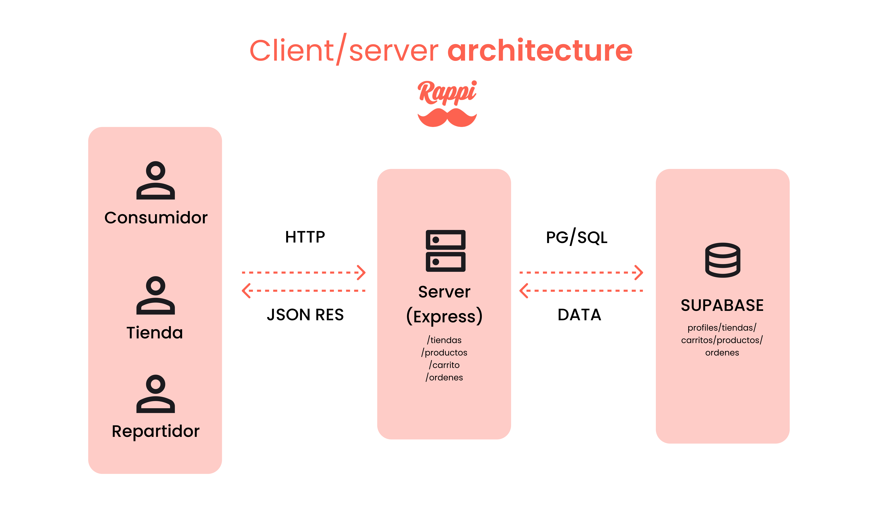
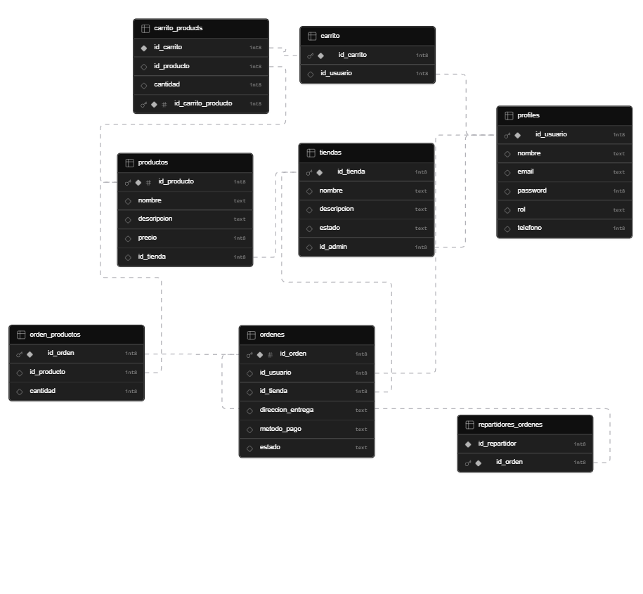

# ヾ(•ω•`)o Rappi

Aplicación de delivery tipo Rappi construida con React, Express y Supabase. Cuenta con tres clientes web independientes y un servidor centralizado.

---

## (oﾟvﾟ)ノ Arquitectura

El sistema sigue una arquitectura **client/server**:
- Los 3 clientes se comunican con el server via **HTTP** y reciben respuestas en **JSON**
- El server consulta Supabase usando **PG/SQL** y recibe los datos de vuelta
- Cada cliente corre en su propio puerto

---

## ( •̀ ω •́ )✧ Base de datos

Las tablas y sus relaciones:

| Tabla | Descripción |
|---|---|
| `profiles` | Todos los usuarios del sistema (clientes, admins, repartidores) |
| `tiendas` | Restaurantes administrados por un `tienda_admin` |
| `productos` | Productos de cada tienda |
| `carrito` | Carrito de compras de cada cliente |
| `carrito_products` | Productos dentro del carrito |
| `ordenes` | Órdenes creadas por los clientes |
| `orden_productos` | Productos de cada orden |
| `repartidores_ordenes` | Relación entre repartidores y órdenes aceptadas |

---

## ¬_¬ Stack

- **Frontend**: React + TypeScript + Tailwind CSS + DaisyUI
- **Backend**: Node.js + Express
- **Base de datos**: Supabase (PostgreSQL)
- **Herramientas**: Husky + Prettier + Concurrently
